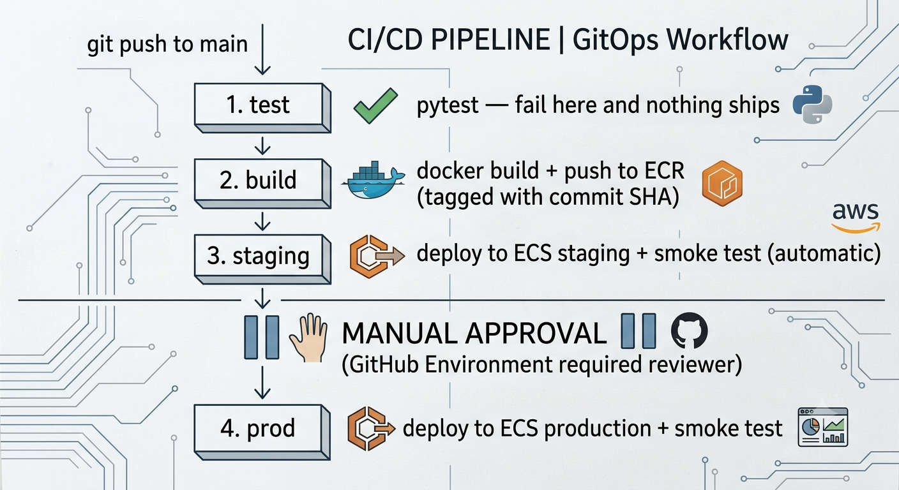

# CI/CD Pipeline: GitHub Actions → AWS ECS

A complete continuous-delivery pipeline. Every push to `main` runs tests,
builds and pushes a Docker image to ECR, deploys to a **staging** ECS service,
smoke-tests it, then **waits for manual approval** before deploying to
**production**. Infrastructure is provisioned with Terraform; the app is a
containerized Python/Flask service.

---

## Pipeline
<p align="center">
  
</p>
---

## What this project covers

| Concept | Implementation |
|---|---|
| Trigger on push | `on: push: branches: [main]` |
| Continuous Integration | pytest gate — broken code never builds |
| Build & registry | Docker image pushed to ECR, tagged by commit SHA |
| Continuous Delivery | Auto-deploy to staging, gated promotion to production |
| Manual approval | GitHub Environment with required reviewers before prod |
| Secret management | AWS keys stored as encrypted GitHub Actions secrets |
| Least-privilege CI | Dedicated IAM user scoped to ECR + ECS + PassRole only |
| IaC / pipeline boundary | Terraform owns infra; pipeline owns the running image |
| Two environments | staging + production via Terraform `for_each` |
| Post-deploy verification | Python smoke test against the live endpoint |
| Zero-downtime deploys | ECS rolling update with wait-for-stability |

---

## Repository structure
```
.
├── app
│   ├── app.py
│   ├── Dockerfile
│   ├── __init__.py
│   ├── __pycache__
│   │   └── app.cpython-312.pyc
│   ├── pyproject.toml
│   ├── requirements-dev.txt
│   ├── requirements.txt
│   └── tests
│       ├── __pycache__
│       │   └── test_app.cpython-312-pytest-8.2.2.pyc
│       └── test_app.py
├── docs
│   └── decisions
├── media
│   └── pipeline.png
├── README.md
├── scripts
│   └── smoke_test.py
└── terraform
    ├── example.tfvars
    ├── iam.tf
    ├── main.tf
    ├── outputs.tf
    ├── terraform.tfstate
    ├── terraform.tfstate.backup
    ├── variables.tf
    └── versions.tf
```
---

## How the IaC / pipeline ownership boundary works

Terraform creates the cluster, ALB, ECR, IAM roles, and the **initial** ECS
services. After that, the pipeline owns deployments: it registers new task
definition revisions and updates the services. Terraform is told to ignore
those changes:

```hcl
lifecycle {
  ignore_changes = [task_definition, desired_count]
}
```

Without this, the next `terraform apply` would revert the service to its
bootstrap image, wiping out the latest deploy. **Terraform owns the shape of
the infrastructure; the pipeline owns what's running inside it.** See
[ADR-001](docs/decisions/001-iac-pipeline-boundary.md).

---

## Setup

**Prerequisites:** AWS account, Terraform 1.5+, Docker, a GitHub repo.

```bash
# 1. Bootstrap infra (two-stage apply seeds an initial image)
cd terraform
terraform apply -target=aws_ecr_repository.app
export ECR_URL=$(terraform output -raw ecr_repository_url)
aws ecr get-login-password --region us-east-1 | docker login --username AWS --password-stdin "${ECR_URL%/*}"
docker build -t "${ECR_URL}:latest" ../app && docker push "${ECR_URL}:latest"
terraform apply

# 2. Create the CI access key
aws iam create-access-key --user-name $(terraform output -raw ci_user_name)
```

Then in GitHub → Settings:
- **Secrets:** `AWS_ACCESS_KEY_ID`, `AWS_SECRET_ACCESS_KEY`
- **Variables:** `AWS_REGION`, `ECR_REPOSITORY`, `ECS_CLUSTER`, `STAGING_URL`, `PRODUCTION_URL`
- **Environments:** create staging and production; keep staging unprotected, and add a required reviewer to production

Push to `main` and watch the Actions tab. Approve the production deploy when prompted.

---

## Key decisions explained

**Why GitHub Actions instead of AWS CodePipeline?**
Running both is redundant — they solve the same problem. GitHub Actions keeps
the pipeline next to the code and uses one tool end-to-end. The README's
architecture maps each stage to its CodePipeline/CodeBuild/CodeDeploy
equivalent for reference. See
[ADR-002](docs/decisions/002-github-actions-vs-codepipeline.md).

**Why a dedicated, scoped CI IAM user?**
CI credentials are a prime attack target. The deployer user can push to one ECR
repo, update the two ECS services, and pass exactly two roles — nothing else.
A leak can deploy a container, not take over the account.

**Why a manual gate before production?**
This is Continuous *Delivery*: everything to staging is automated, but the
promotion to production is a deliberate human decision — the deployment
equivalent of reviewing a `terraform plan` before `apply`.

**Why tag images with the commit SHA?**
Immutable, traceable tags. Any running task maps back to an exact commit, and
rollback means redeploying a known SHA. Tagging everything `latest` loses that.

---

## What I'd add next

- OIDC federation (GitHub → AWS) to eliminate long-lived access keys
- Reusable workflow to DRY up the staging/production deploy jobs
- CodeDeploy blue/green deployment for instant rollback
- Terraform plan/apply automation in its own pipeline (infra CI/CD)
- Trivy image scan as a gate before push
- Slack/SNS notification on deploy and on approval-needed

---

## Author
Wael Daikhi
<a href="https://github.com/wael-daikhi" target="_blank">GitHub</a> · 
<a href="https://linkedin.com/in/wael-daikhi" target="_blank">LinkedIn</a>